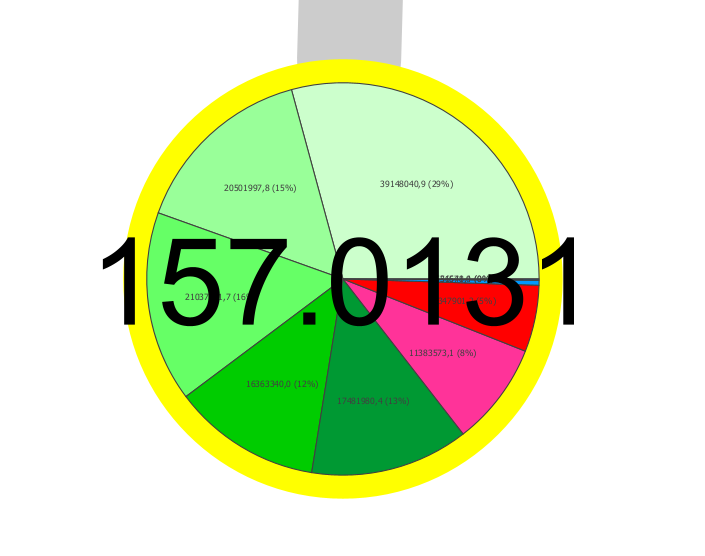

# Metabolomics analysis report
SBL.20004 

24.05.2023

----
Group A
- Edouard BRUELHART
- Dominic STEINER
- Cyril JAGGI
----

## Introduction

Plants are one of the least mobile organisms on this planet and this can pose a problem when dealing with predators, because the option to flee is not really available to them. Some plants are thus using toxins to deal with adversaries. These compounds allow the plant to defend against potential predators by disincentivicing their consumption. 

One of these toxic compunds is aconitine, a toxic alkaloid found in Aconitum, that acts on sodium-ion channels and inhibits conformational change of the channel protein. This inhibition blocks membrane repolerization and causes the premature excitation of afflicted neurons. Exposure to aconitine can lead to an arrhythmic heartbeat, nausea, vomiting and systemic paralysis, and with an LD50 of around 0.12-0.2mg/kg it is safe to say that arconitine is a very potent toxin [^11].

Aconitum on the other hand are hardly the only toxic plants in nature and neurotoxiological compounds can also be found in other species, like Delphinium. What makes this interesting, is the fact that these toxins are end-products of a multi-step biosynthesis pathways and if plants produce aconitine or aconitine derivates then there should be similarities between these synthesis pathways. To test this we chose multiple species of aconitum, delphinium and ranunculus and analyzed their metabolites, to verify these suspected similarities. 

The choice of aconitum was an easy one, because it contains the sought after aconitine and could be useful as a positive control in our measurements. Delphinium was also a clear choise, due to the fact that some delphinium species can contain aconitine and thus might provide additional information on the synthesis pathway. As for Ranunculus, these plants also stand amidst the roster of poisenous plants and caught our attention in that regard [^12].

## Material & Methods

### Sample collection

- Collection site(s):
    - Botanical garden of the University of Fribourg
- Collected species: 
    - Delphinium elatum (14-O-deacetylnudiculine, delpheline, deltaline, elatine, lycoctonine, méthyllycaconitine, nudicauline) [^4]
    - Delphinium caucasicum (not available precisely for this species)
    - Ranunculus auricomus (protoanemonin) [^3]
    - Ranunculus aconitifolius (few ranunculin, very low toxicity) [^5]
    - Ranunculus repens (ranunculin) [^6] --> ranunculin disapears when plant is dried, if we don't have it this is normal
    - Ranunculus gramineus (protoanemonin)
    - Ranunculus arvensis (protoanemonin)
    - Ranunculus muricatus (substances have not been isolated, but it's toxicity and medicinal properties have been proven on mices) [^7]
    - Ranunculus acris friesianus (ranunculin) [^8]
    - Aconitum carmichaelii (aconitine, mesaconitine, hypaconitine, benzoylaconitine, benzoylmesaconitine, and benzoylhypaconitine) [^9]
    - Aconitum napellus (aconitine, aconine, capeline, hypoaconitine, jesaconitine, lycaconitine, mésaconitine, néoline, néopelline) [^10] --> one of the most toxic european plants
    - Aconitum variegatum (no clear information but also very toxic)
    - Aconitum vulparia (no clear information but also very toxic)
- iNaturalist entries.
    - [Observation Data](https://github.com/Cythion/SBL.20004/blob/main/data/observations-328542.csv)

### Sample preparation

1. 50mg dried plant leaves were weight into a 2mL Eppendorf tube.
2. 3 metal beads were loaded together with the leaves.
3. Lysed cells in ball mill for 2.5min at 25 Hertz 
4. 1.7mL extraction solvent (20% water, 80% MetOH, 0.1% formic acid) were added to each tube and mixed.
5. Samples were mixed again in the bell mill for 2.5min at 25 Hertz. 
6. Part of the supernatant was then transferred into a glass vial for the measurement and part was storred in another vial as reserve.
7. Samples were then measured in the LC-MS. 

### LCMS Analysis

- [LC conditions verbose](https://github.com/Cythion/SBL.20004/blob/main/lc_conditions.txt) 
    - The LC program consists of a 12min run in which a first gradiant ramps up the acetonitrile (ACN) composition from 5% up to 100% over the course of 6min. After that it keeps this up for another 2min before switching back to the initial 5% ACN / 95% water mixture. With the initial conditions the progam equilibrates for 4m and reaching the 12min mark. The flow rate and column temperature stay the same during the whole run, at 0.600mL/min and 40°C respectivly.
- [MS conditions verbose](https://github.com/Cythion/SBL.20004/blob/main/ms_conditions.txt)

### Data treatment

- MZ-Mine [MZ-Mine File](https://github.com/Cythion/SBL.20004/blob/main/MZ_mine_all.mgf)
    1. Data Import
    2. MS peak detection
    3. Chromatogram building 
    4. Chromatogram deconvolution <!--For: Peak identification, Improove peak shape ect by adding the time factor of LC == 3D -->
    5. Isotope grouping
    6. Feature alignment
    7. Manual vlaidation 
    8. File export for visualization 

- GNPS [GNPS](https://gnps.ucsd.edu/ProteoSAFe/status.jsp?task=54c7e463fe00492a9984c160219fb1d6)
    1. Annotation [Annotation File](https://github.com/Cythion/SBL.20004/blob/main/all_annotations.csv)

### Data visualization 

- Cytoscape 
    1. Visualization of molecular network [Molecular Newtork File]()
## Results
 

*Figure 1: Color Code*

*Figure 2: Aconitine cluster with aconitine [^13] (646.3222) and 3-Acetylaconitine [^14] (688.3325)* 

*Figure 3: Aconic acid* [^15]

*Figure 4: Aconine*

*Figure 5: methyllycaconitine perchlorate [^16] only on delphinium, but linked with aconitum*

*Figure 6: lycoctonine* [^17]

*Figure 7: napelline*

### MS1

There have been arround 3500 hits
[Final feature list](https://github.com/Cythion/SBL.20004/blob/main/data/Final_Aligned_Feature_List.csv)

### Molecular Network

- Link to the [GNPS job](https://gnps.ucsd.edu/ProteoSAFe/status.jsp?task=54c7e463fe00492a9984c160219fb1d6).
- Link to the [GNPS identification table](https://gnps.ucsd.edu/ProteoSAFe/result.jsp?task=54c7e463fe00492a9984c160219fb1d6&view=view_all_annotations_DB).

## Conclusion

Preliminary data shows that the measurement techniques used in this experiment are indeed able to detect aconitin or aconitine adjacent molecules in aconitum plants (Fig. 2). In other nodes the presence of aconine was also detected, mainly in aconitum napellus. This compound is a degragation product of aconitine[^18] and even though it is less toxic than aconitin itself it still is shows effects on differentiating cells. One study has shown that aconine is able to inhibit osteoclast differentiation, in mouse leukemic monocyte/macrophage cell line RAW264.7, through the indirect inhibition of NF-kappaB signalling[^19].

In an other cluster methyllycaconitine perchlorate[^16] was found and it seems to form a main divide in the cluster with clear seperation between aconitum and delphinium (Fig. 5). This could mean that delphinium has its own aconitin variant which can still be related to the version found in aconitum plants.

Other toxic compound found in this experiment were lycoctonine, known to be found in delphinium elatum[^4], and napelline, known to be in aconitum napellus[^10]. Besides showing up in the known plant we also could verify their presence in other member of their genus. Hinting at the interconnectivity of these toxins, wich we were trying to show in this preliminary study.

As for Ranunculus, there we unfortunatly did not find good connections to the other two plants and even the signiture toxin, ranunculin, was not present in our data, although this might be due to the high volatility of this compound. 

## References

Note that you can make a footnote like this[^1]

[^1]: https://ccms-ucsd.github.io/GNPSDocumentation/featurebasedmolecularnetworking-with-mzmine2/
[^2]: https://pubs.rsc.org/en/content/articlehtml/2020/ra/d0ra00813c
[^3]: https://www.sciencedirect.com/topics/pharmacology-toxicology-and-pharmaceutical-science/protoanemonin
[^4]: https://fr.wikipedia.org/wiki/Delphinium_elatum
[^5]: https://www.eagff.ch/fr/connaitre-les-plantes-des-prairies/autres-plantes/caracteristiques-par-espece/renoncule-a-feuilles-daconit
[^6]: https://fr.wikipedia.org/wiki/Renoncule_rampante
[^7]: https://www.researchgate.net/publication/306167485_Phytochemical_analysis_and_cardiotonic_activity_of_methanolic_extract_of_Ranunculus_muricatus_Linn_in_isolated_rabbit_heart
[^8]: https://fr.wikipedia.org/wiki/Renoncule_%C3%A2cre
[^9]: https://onlinelibrary.wiley.com/doi/full/10.1002/bmm2.12019
[^10]: https://fr.wikipedia.org/wiki/Aconitum_napellus
[^11]: Ameri, A. The effects of Aconitum alkaloids on the central nervous system. Progress in Neurobiology 56, 211-235 (1998).
[^12]: Hunnius pharmazeutisches Wörterbuch. (de Gruyter, 1998).
[^13]: https://pubchem.ncbi.nlm.nih.gov/compound/245005
[^14]: https://pubchem.ncbi.nlm.nih.gov/compound/21599000
[^15]: https://pubchem.ncbi.nlm.nih.gov/compound/14372240
[^16]: https://pubchem.ncbi.nlm.nih.gov/compound/102601948
[^17]: https://pubchem.ncbi.nlm.nih.gov/compound/99924
[^18]: Li, H. Q. et al. Supramolecular structure, in vivo biological activities and molecular-docking-based potential cardiotoxic exploration of aconine hydrochloride monohydrate as a novel salt form. Acta Crystallogr B Struct Sci Cryst Eng Mater 76, 208-224 (2020).
[^19]: Zeng, X. et al. Aconine inhibits RANKL-induced osteoclast differentiation in RAW264.7 cells by suppressing NF-κB and NFATc1 activation and DC-STAMP expression. Acta Pharmacol Sin 37, 255-263 (2016).

