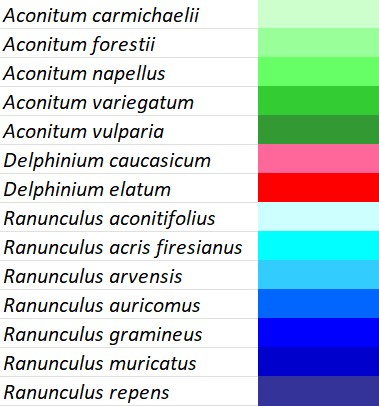
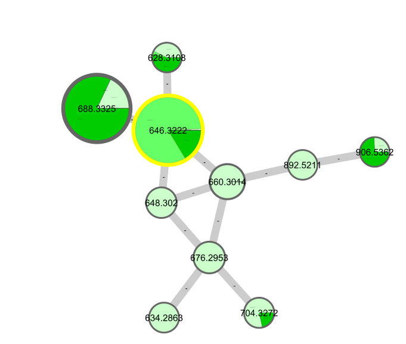
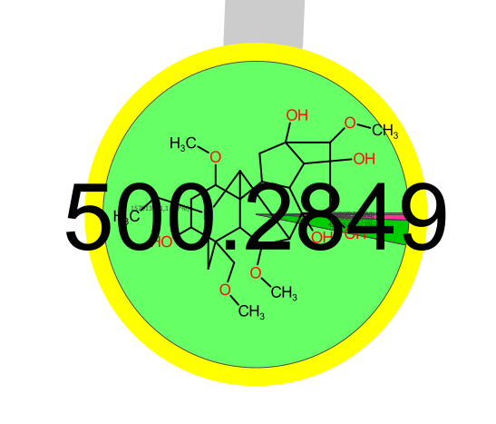
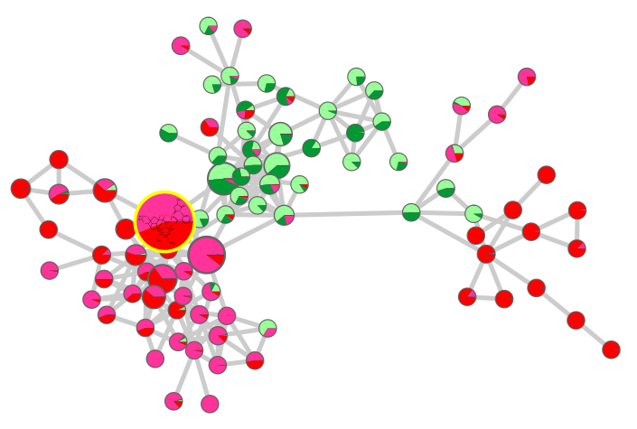
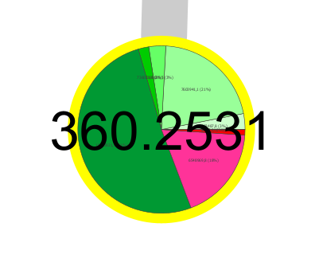

# Metabolomics analysis report
SBL.20004 

24.05.2023

----
Group A
- Edouard BRUELHART
- Dominic STEINER
- Cyril JAGGI
----

## Introduction

Plants are one of the least mobile organisms on this planet and this can pose a problem when dealing with predators, because the option to flee is not really available to them. Some plants are thus using toxins to deal with adversaries. These compounds allow the plant to defend against potential predators by disincentivicing their consumption. 

One of these toxic compounds is aconitine, a toxic alkaloid found in Aconitum, that acts on sodium-ion channels and inhibits conformational change of the channel protein. This inhibition blocks membrane repolarization and causes the premature excitation of afflicted neurons. Exposure to aconitine can lead to an arrhythmic heartbeat, nausea, vomiting and systemic paralysis, and with an LD50 of around 0.12-0.2mg/kg it is safe to say that arconitine is a very potent toxin [^11].

Aconitum, on the other hand, are hardly the only toxic plants in nature and neurotoxiological compounds can also be found in other species, like Delphinium. What makes this interesting, is the fact that these toxins are end-products of a multi-step biosynthesis pathway and if plants produce aconitine or aconitine derivates then there should be similarities between these synthesis pathways. To test this, we chose multiple species of aconitum, delphinium and ranunculus and analyzed their metabolites, to verify these suspected similarities. 

The choice of aconitum was an easy one, because it contains the sought after aconitine and could be useful as a positive control in our measurements. Delphinium was also a clear choice, due to the fact that some delphinium species can contain aconitine and thus might provide additional information on the synthesis pathway. As for Ranunculus, these plants also stand amidst the roster of poisenous plants and caught our attention in that regard [^12].

### Toxic compounds known to be present on the collected species

Delphinium: 14-O-deacetylnudiculine, delpheline, deltaline, elatine, lycoctonine, méthyllycaconitine, nudicauline [^4] [^2]

Ranunculus: protoanemonin, ranunculin [^3] [^5] [^7] [^8]

Aconitum: aconitine, aconine, capeline, mesaconitine, hypoaconitine, benzoylaconitine, jesaconitine, benzoylmesaconitine, lycaconitine, neoline, neopelline, benzoylhypaconitine [^9] [^10]

## Material & Methods

### Sample collection

- Collection site(s):
    - Botanical garden of the University of Fribourg
- Collected species: 
    - Delphinium elatum
    - Delphinium caucasicum
    - Ranunculus auricomus
    - Ranunculus aconitifolius
    - Ranunculus repens
    - Ranunculus gramineus
    - Ranunculus arvensis
    - Ranunculus muricatus
    - Ranunculus acris friesianus
    - Aconitum carmichaelii
    - Aconitum napellus
    - Aconitum variegatum
    - Aconitum vulparia
- iNaturalist entries.
    - [Observation Data](https://github.com/Cythion/SBL.20004/blob/main/data/observations-328542.csv)

### Sample preparation

1. 50mg dried plant leaves were weight into a 2mL Eppendorf tube.
2. 3 metal beads were loaded together with the leaves.
3. Lysed cells in ball mill for 2.5min at 25 Hertz 
4. 1.7mL extraction solvent (20% water, 80% MetOH, 0.1% formic acid) were added to each tube and mixed.
5. Samples were mixed again in the bell mill for 2.5min at 25 Hertz. 
6. Part of the supernatant was then transferred into a glass vial for the measurement and part was storred in another vial as reserve.
7. Samples were then measured in the LC-MS. 

### LC-MS Analysis

- [LC conditions verbose](https://github.com/Cythion/SBL.20004/blob/main/lc_conditions.txt) 
    - The LC program consists of a 12min run in which a first gradiant ramps up the acetonitrile (ACN) composition from 5% up to 100% over the course of 6min. After that it keeps this up for another 2min before switching back to the initial 5% ACN / 95% water mixture. With the initial conditions the progam equilibrates for 4m and reaching the 12min mark. The flow rate and column temperature stay the same during the whole run, at 0.600mL/min and 40°C respectivly.
- [MS conditions verbose](https://github.com/Cythion/SBL.20004/blob/main/ms_conditions.txt)

### Data treatment

- MZ-Mine [MZ-Mine File](https://github.com/Cythion/SBL.20004/blob/main/MZ_mine_all.mgf) [^1]
    1. Data Import
    2. MS peak detection
    3. Chromatogram building 
    4. Chromatogram deconvolution <!--For: Peak identification, Improves peak shape ect by adding the time factor of LC == 3D -->
    5. Isotope grouping
    6. Feature alignment
    7. Manual vlaidation 
    8. File export for visualization 

- GNPS [GNPS](https://gnps.ucsd.edu/ProteoSAFe/status.jsp?task=54c7e463fe00492a9984c160219fb1d6)
    1. Annotation [Annotation File](https://github.com/Cythion/SBL.20004/blob/main/all_annotations.csv)

### Data visualization 

- Cytoscape 
    1. Visualization of molecular network [Molecular Network File](data/molecular_network.cys)
## Results

Each plant we analyzed has it's own color code (Figure 1). In addition, each color gradient represents the genus (green for *aconitum*, red for *delphinium* and blue for *ranunculus*).

 

*Figure 1: Color Code*

Aconitine has been annotated among the compounds detected through mass spectrometry (Figure 2). It's interesting, because aconitine and 3-acetylaconitine are present in high quantity, but we still have other compounds that have been detected in lower quantity, and are not annotated. So we can imagine that these are some other similar compounds or precursors of the aconitine. Without much suprise, this cluster shows that these compounds are only present in aconitum genus.

*Figure 2: Aconitine cluster with aconitine [^13] (646.3222) and 3-Acetylaconitine [^14] (688.3325)* 

We have also found aconine, that is present on some aconitum, delphinium and ranunculus species (Figure 4). This compound is a less toxic alkaloid as aconitine, known to be produced by aconitum carmichaelii [^20].

*Figure 3: Aconine*

methyllcaconitine perchlorate, near from lycoctonine, has been found on delphinium (Figures 4 and 5). This is interesting, because we have a cluster composed of a part only found in delphinium and a part only found in aconitum.

*Figure 4: methyllycaconitine perchlorate [^16] only on delphinium, but linked with aconitum*

*Figure 5: lycoctonine* [^17]

A compound has been annotated as napelline, a potential anticancer [^21]. It's present on all analyzed aconitum and delphinium species (Figure 6). 

*Figure 6: napelline*

### MS1

There have been arround 3500 hits
[Final feature list](https://github.com/Cythion/SBL.20004/blob/main/data/Final_Aligned_Feature_List.csv)

### Molecular Network

- Link to the [GNPS job](https://gnps.ucsd.edu/ProteoSAFe/status.jsp?task=54c7e463fe00492a9984c160219fb1d6).
- Link to the [GNPS identification table](https://gnps.ucsd.edu/ProteoSAFe/result.jsp?task=54c7e463fe00492a9984c160219fb1d6&view=view_all_annotations_DB).

## Conclusion

Preliminary data shows that the measurement techniques used in this experiment are indeed able to detect aconitin or aconitin adjacent molecules in aconitum plants (Fig. 2). In other nodes the presence of aconine was also detected, mainly in aconitum napellus. This compound can be obtained by protonation of aconitin[^18] and it was present, in small amounts in delphinium (Fig. 3), but the presence of aconitine was not. This could mean that aconine could be a potential precursor, produced by both delphinium and aconitum, but only aconitum might deprotonate this compound to reach aconitin. Aconine even though it is less toxic than aconitin itself it still shows effects on differentiating cells. One study has shown that aconine is able to inhibit osteoclast differentiation, in mouse leukemic monocyte/macrophage cell line RAW264.7, through the indirect inhibition of NF-kappaB signalling[^19].

In an other cluster methyllycaconitine perchlorate[^16] was found and it seems to form a main divide in the cluster with clear seperation between aconitum and delphinium (Fig. 4). This could mean that delphinium has its own aconitin variant which can still be related to the version found in aconitum plants. Other toxic compound found in this experiment were lycoctonine, known to be found in delphinium elatum[^4], and napelline, known to be in aconitum napellus[^10]. Besides showing up in the known plant we also could verify their presence in other member of their genus(Fig 5, 6). Hinting at the interconnectivity of these toxins, wich we were trying to show in this preliminary study.

As for Ranunculus, there we unfortunatly did not find good connections to the other two plants and even the signature toxin, ranunculin, was not present in our data, although this might be due to the high volatility of this compound, which we might not be able to measure with our current setup. The extraction of plants with more apolar solven and the inclusion of GC-MS measurements could maybe improve the spectra of detecteable compounds.

All in all it shows that toxic compounds and their derivates can be found across different species and genuses.

[^1]: https://ccms-ucsd.github.io/GNPSDocumentation/featurebasedmolecularnetworking-with-mzmine2/

[^2]: https://pubs.rsc.org/en/content/articlehtml/2020/ra/d0ra00813c

[^3]: https://www.sciencedirect.com/topics/pharmacology-toxicology-and-pharmaceutical-science/protoanemonin

[^4]: https://www.ncbi.nlm.nih.gov/pmc/articles/PMC8028511/

[^5]: https://www.eagff.ch/fr/connaitre-les-plantes-des-prairies/autres-plantes/caracteristiques-par-espece/renoncule-a-feuilles-daconit

[^7]: https://www.researchgate.net/publication/306167485_Phytochemical_analysis_and_cardiotonic_activity_of_methanolic_extract_of_Ranunculus_muricatus_Linn_in_isolated_rabbit_heart

[^8]: https://www.jstor.org/stable/2257092?casa_token=3riTCZ5WLE0AAAAA%3AKGg_kqZcARtyAb3Mo_fskVmV_xhVNB3B4HL9bpL1t1ibIW18Uq4LQ3jOFyOLdFAuMd3mkjLq1PnAQW5k3o-0QKzVNySPauWKkZGfp-NMoYuJMDMb

[^9]: https://onlinelibrary.wiley.com/doi/full/10.1002/bmm2.12019

[^10]: https://www.tandfonline.com/doi/abs/10.1080/15563650500357594

[^11]: https://www.sciencedirect.com/science/article/abs/pii/S0301008298000379

[^12]: https://swbplus.bsz-bw.de/cgi-bin/result_katan.pl?item=bsz061523577inh.htm

[^13]: https://pubchem.ncbi.nlm.nih.gov/compound/245005

[^14]: https://pubchem.ncbi.nlm.nih.gov/compound/21599000

[^16]: https://pubchem.ncbi.nlm.nih.gov/compound/102601948

[^17]: https://pubchem.ncbi.nlm.nih.gov/compound/99924

[^18]: https://pubmed.ncbi.nlm.nih.gov/32831223/

[^19]: https://www.nature.com/articles/aps201585.pdf

[^20]: https://pubchem.ncbi.nlm.nih.gov/compound/Aconine

[^21]: https://www.ncbi.nlm.nih.gov/pmc/articles/PMC7450011/

